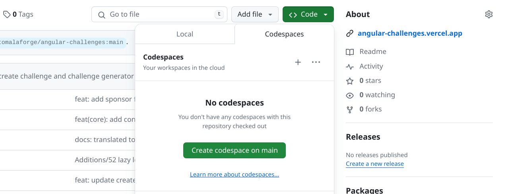

To get started with <b>Angular Challenges</b>, follow these steps:

## Create a GitHub Account

If you wish to submit an answer, you will need to have your own GitHub account. Additionally, having a GitHub account is always beneficial, and it's free.

## Fork the GitHub project

Navigate to the [Angular Challenges Repository](https://github.com/tomalaforge/angular-challenges) and click on the <span class="github-neutral-btn"> <svg aria-hidden="true" height="16" viewBox="0 0 16 16" version="1.1" width="16" data-view-component="true" class="octicon octicon-repo-forked mr-2">
<path d="M5 5.372v.878c0 .414.336.75.75.75h4.5a.75.75 0 0 0 .75-.75v-.878a2.25 2.25 0 1 1 1.5 0v.878a2.25 2.25 0 0 1-2.25 2.25h-1.5v2.128a2.251 2.251 0 1 1-1.5 0V8.5h-1.5A2.25 2.25 0 0 1 3.5 6.25v-.878a2.25 2.25 0 1 1 1.5 0ZM5 3.25a.75.75 0 1 0-1.5 0 .75.75 0 0 0 1.5 0Zm6.75.75a.75.75 0 1 0 0-1.5.75.75 0 0 0 0 1.5Zm-3 8.75a.75.75 0 1 0-1.5 0 .75.75 0 0 0 1.5 0Z"></path></svg>Fork</span> button in the header. This will create a copy of this repository on your own GitHub profile.

## Clone the repository to your local machine

Select a directory on your local computer and clone this repository.

Open a terminal, navigate to the chosen directory, and type the following command:

```bash
git clone https://github.com/[YOUR_GITHUB_NAME]/angular-challenges.git
```

:::note
You can find the clone URL by clicking on the <span class="github-success-btn"><> Code</span> button in your <b>own instance</b> of the Angular Challenges repository.


:::

## Open the project in your favourite IDE

Open the project in any IDE of your choice.

## Install all dependencies

```bash
npm ci
```

## Choose a challenge

Your project is now up and running. The only remaining step is to choose a challenge 🚀

Each challenge consists of:

- <b>Name</b>: indicating what the challenge is about.
- <b>Number</b>: order of creation. The number doesn't have any particular meaning but helps for reference in GitHub Pull Request section.
- <b>Badge</b>: helps visualize the degree of difficulty. It's entirely subjective 😅
  - 🟢 easy
  - 🟠 medium
  - 🔴 difficult

## (Alternately) Use GitHub Codespaces

From your <b>own instance</b> of the Angular Challenges repository, click the code button and navigate to the codespaces tab.



Click the `Create codespace on main` button, and you will navigate to a GitHub codespace.

If you never used a GitHub codespace before, I would recommend you try this short interactive [GitHub Skills Tutorial](https://github.com/skills/code-with-codespaces).

When you navigate to the codespace, there will be a prompt to install the recommended `VS Code` plugins. If you plan on creating a challenge, you can use the `Nx plugin` to generate the starter code. Either way, the codespace will install the dependencies, and you can create a new branch, tackle any challenge, and create a pull request.

When you push to a branch, you do not have to provide a GitHub token.

Once you are finished, remember to pause or delete your codespace. If you don't, GitHub will automatically pause an idle codespace after 30 minutes. You do have a generous amount of free codespace time per month, but it is still important not to waste your allotment.

In the GitHub codespace, copy and paste will be blocked until you give permission.

The GitHub codespace uses port forwarding to serve the projects. Click the prompt after running `npx serve` to navigate to `localhost:4200`.
